# OSC-SDK-PYTHON

## Introdução
:blue_book: OSC-SDK-PYTHON para integração com a API da OSC

## Descrição
```bash
    Esta documentação é feita para ajudar os desenvolvedores a entender melhor suas estruturas e métodos.  
    Aqui você obterá uma compreensão mais profunda de cada método com uma explicação simples, mas completa.  
    Esperamos que esta documentação o ajude a entender melhor o código.
```

## :hourglass: Instalando
Para clonar o projeto e executar essa aplicação, você precisará do [Git](https://git-scm.com) e do [Python](https://www.python.org/) instalados em seu computador.
Depois disso execute os seguintes comandos:

```bash
    # Clone esse repositório
    git clone https://https://github.com/Fitbank-Pagamentos-Eletronicos/osc-sdk-python
```

## :hourglass::hourglass: Como instalar as dependências / pacotes

1. Install virtualenv `pip install --upgrade virtualenv`, caso ainda não instalado na maquina
2. Cirar um novo ambiente para o projeto `virtualenv venv`
3. Ativar o ambiente no terminal `source venv/bin/activate`
4. Instalar dependências `pip install -r requirements.txt`

## :file_folder: Estrutura dos diretórios

A área de trabalho contém as pastas principais, onde:

- `./src` :  Esta é a camada de Domínio, Enums e Requests, aqui você encontrará os Objetos, Enums e Requisições utilizada em toda a estrutura do código;
- `./test` :  Esta é a camada do código onde será encontrado os testes de Domains e Requests;
- `./venv` :  Esta é a camada do código onde será encontrado todos os pacotes instalados para o projeto;

para as subpastas, é dividico na seguinte estrutura:

- `./src/domains` :  É onde estão localizados todos os Domínios;
- `./src/enums` :  É aqui que estão loxalizados todos os Enums;
- `./src/requests` :  É onde estão localizados os Objetos que são utilizados para mapear as requisições e as respostas das requisições;
<details>
  <summary><h4> 📂 Estrutura completa de pastas: </h4></summary>
  
```
    📦osc-sdk-python
    ┣ 📂.pytest_cache
    ┣ 📂.vscode
    ┣ 📂example
    ┣ 📂src
    ┃ ┣ 📂domains
    ┃ ┣ 📂enums
    ┃ ┣ 📂requests  
    ┃ ┗ 📂utils
    ┃ 📂test
    ┃ ┣ 📂domains
    ┃ ┗ 📂requests  
    ┗ 📂venv
```
</details>

## :page_with_curl: Métodos

Os métodos estáo disponíveis na pasta `src/requests` e são:
 
- [x] `OAuth` - Criação do token de autenticação para o uso em endpoints. O resultado  é o `AuthSucess`.
- [x] `DocumentRequest` - Envia um documento para análise. O resultado é o `DocumentResponse`.
- [x] `ProposalRequest` - Recolhe e valida dados necessários para a criação de propostas de acordo com os tipos de produtos selecionados. O resultado é o `PipelineProposal`.
- [x] `PubSub` - Obtém o ID do projeto, ID do tópico e outras coisas. O resultado é o `PubSubResponse`.
- [x] `PubsubSubscribe` - Usa os dados retornados do `PubSub` e cria um ouvinte.
- [x] `SimpleSignup` - Realiza o cadastro de usuários(pode retornar erro caso o usuário já exista). O resultado é o `SignupResponse`.
- [x] `SignupMatchRequest` - Faz a inscrição de usuários e retorna os produtos de créditos com maior chance de aprovação. O resultado é o `SignupMatchResponse`. 
- [x]  `OSC` - Realiza a criação de instancias de OSC.

##  :hammer_and_wrench: Como executar os testes


```bash
    # Entrar no diretório de testes 📂test --> 📂domains  
    procure pela pasta 📂test --> 📂domains  
    clicar com o botão direito na 📂domains onde se encontra os testes de domains  
    depois clique em Run 'Python tests in domains.  
    
    # Entrar no diretório de testes 📂test --> 📂requests  
    procure pela pasta 📂test --> 📂domains  
    clicar com o botão direito na 📂domains onde se encontra os testes de requests  
    depois clique em Run 'Python tests in domains.
```


## :dart: Signup & Simple Signup Fluxograma

```mermaid
sequenceDiagram
    participant Client
    participant SDK
    participant Auth
    participant API

    Client->>+SDK: OSC.createInstance(client_id, client_secret)
    SDK-->>-Client: instancia osc
    
    Client->>+SDK: osc.signup(signupObject)
        opt Não autorizado 
            SDK->>+Auth: auth(client_id, client_secret, scope)
            Auth-->>-SDK: access_token
        end
        SDK->>+API: signup(signupJson, access_token)
        API-->>-SDK: pipelineJson
    SDK-->>-Client: pipeline instance
```



<details>
<summary><h3>Code</h3></summary>


```Python
    class Signup:

    @staticmethod
    def request(token: str, signup: SignupMatch) -> Pipeline:
        server_url = os.getenv('server_url')

        payload = signup.to_json()
        headers = {
            'Content-Type': 'application/json',
            'Authorization': f'Bearer {token}'
        }

        response = requests.post(
            f'{server_url}/v2.1/process/signup', headers=headers, data=payload)

        if response.status_code != 201:
            raise Exception(response.text)

        return Pipeline.from_json(response.text)

    @staticmethod
    def request(token: str, signup: SimpleSignup) -> Pipeline:
        server_url = os.getenv('server_url')

        payload = signup.to_json()
        headers = {
            'Content-Type': 'application/json',
            'Authorization': f'Bearer {token}'
        }

        response = requests.post(
            f'{server_url}/v2.1/process/simple_signup', headers=headers, data=payload)

        if response.status_code != 201:
            raise Exception(response.text)

        return Pipeline.from_json(response.text)

    
```
</details>

## :dart: Signup + Proposal Fluxograma


<details>
<summary><h3>Code</h3></summary>

```Python
    class OProposal:

    @staticmethod
    def request(osc: Osc, pipeline_id: str, proposal: Proposal) -> Pipeline:
        server_url = os.getenv('server_url')

        token = osc.get_token()
        payload = proposal.to_json()
        headers = {
            'Content-Type': 'application/json',
            'Acccept': 'aplication/json',
            'Authorization': f'Bearer {token}'
        }

        response = requests.post(
            f'{server_url}/v2.1/process/proposal/{pipeline_id}', headers=headers, data=payload)

        return Pipeline.from_json(response.text)

    @staticmethod
    def request(osc: Osc, pipeline_id: str, proposal: ProposalBankAccount) -> Pipeline:
        server_url = os.getenv('server_url')

        token = osc.get_token()
        payload = proposal.to_json()
        headers = {
            'Content-Type': 'application/json',
            'Acccept': 'aplication/json',
            'Authorization': f'Bearer {token}'
        }

        response = requests.post(
            f'{server_url}/v2.1/process/simple_proposal/{pipeline_id}', headers=headers, data=payload)

        return Pipeline.from_json(response.text)
    
```
</details>

## :dart: PubSub Fluxograma


<details>
<summary><h3>Code</h3></summary>

```Python
    def get_config(token: str) -> PubSubConfig:
    server_url = os.getenv('server_url')

    headers = {
        'Authorization': f'Bearer {token}'
    }

    response = requests.get(
        f'{server_url}/v2.1/pubsub', headers=headers)

    return PubSubConfig.from_json(response.text)


def subscribe(project_id: str, topic_id: str, subscription_id: str, service_account: str,
              listening_function: Callable[[Pipeline], None]):
    topic_name = f'projects/{project_id}/topics/{topic_id}'
    subscription_name = f'projects/{project_id}/subscriptions/{subscription_id}'

    service_account_info = json.loads(service_account)
    # audience = "https://www.googleapis.com/auth/pubsub"
    audience = "https://pubsub.googleapis.com/google.pubsub.v1.Subscriber"
    credentials = jwt.Credentials.from_service_account_info(service_account_info, audience=audience)

    executor = ThreadPoolExecutor(max_workers=1)

    def callback(message):
        print(message.data)
        pipeline = Pipeline.from_json(message.data)
        executor.submit(listening_function, pipeline)
        message.ack()

    subscriber = pubsub_v1.SubscriberClient(credentials=credentials)
    subscriber.create_subscription(name=subscription_name, topic=topic_name)
    return subscriber.subscribe(subscription_name, callback)
    
```
</details>

## :dart: Fluxo completo


<details>
<summary><h3>Code</h3></summary>

```Python
    

class CompleteExemplo:

	def main():
    client_id = ""
    client_secret = ""
    osc = OSC.create_instance(client_id, client_secret)

    try:
        osc.set_response_listening(process_pipeline_result)
        pipeline_response = signup()
        process_pipeline_result(pipeline_response)
    except Exception as e:
        print(e)

    def process_pipeline_result(pipeline_response):
        if not pipeline_response:
            print("Pipeline: error")
            return

    status = pipeline_response.get_status()
    if status == "SIGNUP_ANALISIS":
        print("Pipeline: {} (cadastro em analise)".format(pipeline_response.get_id()))
    elif status == "SIGNUP_COMPLETED":
        print("Pipeline: {} (enviar solicitação de proposta)".format(pipeline_response.get_id()))
        proposal(pipeline_response.get_id())
    elif status == "SIGNUP_DENIED":
        print("Pipeline: {} (cadastro reprovado)".format(pipeline_response.get_id()))
    elif status == "PROPOSAL_ANALISIS":
        print("Pipeline: {} (proposta em analise)".format(pipeline_response.get_id()))
    elif status == "PROPOSAL_CREATED":
        print("Pipeline: {} (proposta(s) criadas)".format(pipeline_response.get_id()))
        proposals = pipeline_response.get_proposals()
        pendent_doc = True
	
	proposals = []
    
        for p in proposals:
            if p is not None:
                if p.getHasDocuments():
                    document_request = None
                    for pendent_document in p.getPendentDocuments():
                        if pendent_document == "SELF":
                            document_request = DocumentRequest(DocumentType.SELF, MimeType.CODE_01, "name", "base 64")
                        elif pendent_document == "ADDRESS_PROOF":
                            document_request = DocumentRequest(DocumentType.ADDRESS_PROOF, MimeType.CODE_01, "name", "base 64")
                        elif pendent_document == "IDENTITY_BACK":
                            document_request = DocumentRequest(DocumentType.IDENTITY_BACK, MimeType.CODE_01, "name", "base 64")
                        elif pendent_document == "IDENTITY_FRONT":
                            document_request = DocumentRequest(DocumentType.IDENTITY_FRONT, MimeType.CODE_01, "name", "base 64")
                        elif pendent_document == "INCOME_PROOF":
                            document_request = DocumentRequest(DocumentType.INCOME_PROOF, MimeType.CODE_01, "name", "base 64")
                        br.com.fitbank.requests.Document.putDocument(osc, document_request, pipeline_response.getId())
                else:
                    pendent_doc = False
				
	if not pendentDoc:
        if p:
            if p.getHasContracts():
                signContractRequest = None
                customServiceNumber = None

                s = postContract(osc, customServiceNumber, signContractRequest)
                signContracts = [s.getAceptedCheckSum()]

                signedSignContractRequest = SignContractRequest(signContracts, None)
                postContract(osc, customServiceNumber, signedSignContractRequest)

	if pipelineResponse.getStatus() == "PROPOSAL_APPROVED":
		print("Pipeline: {} (proposta aprovada)".format(pipelineResponse.getId()))
	elif pipelineResponse.getStatus() == "PROPOSAL_DENIED":
		print("Pipeline: {} (proposta reprovada)".format(pipelineResponse.getId()))
	else:
		print("Pipeline: {}".format(pipelineResponse.getId()))

def signup():
	data = ""
	signupRequest = json.loads(data, object_hook=lambda d: namedtuple('X', d.keys())(*d.values()))
	return OSC.getIntance().signup(signupRequest)

def proposal(id):
	data = ""
	proposalRequest = json.loads(data, object_hook=lambda d: namedtuple('X', d.keys())(*d.values()))
	return OSC.getIntance().proposal(proposalRequest, id)

    
```
</details>


## Referências

1. https://developers.easycredito.com.br/
2. https://pypi.org/project/google-cloud-pubsub/
3. https://cloud.google.com/pubsub/lite/docs/reference/libraries#client-libraries-install-python
4. https://www.python.org/

## Other Projects:

1. https://github.com/Fitbank-Pagamentos-Eletronicos/osc-sdk-csharp
2. https://github.com/Fitbank-Pagamentos-Eletronicos/osc-sdk-nodejs
3. https://github.com/Fitbank-Pagamentos-Eletronicos/osc-sdk-go
4. https://github.com/Fitbank-Pagamentos-Eletronicos/osc-sdk-java
